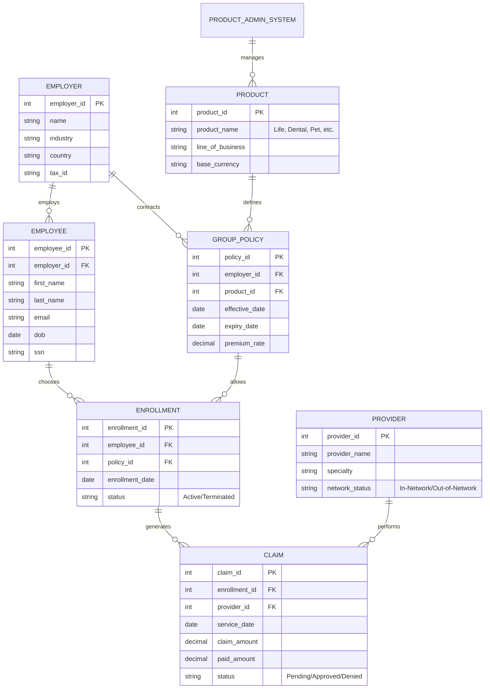

# Entity Relationship Diagram (ERD) - Shukla Healthcare

## Business Narrative
Shukla Healthcare operates by signing contracts with **Employers** (Groups). Each contract results in a **Group Policy** for a specific **Product** (e.g., Dental). Once the policy is active, **Employees** can register via the **Enrollment** system. When an employee visits a **Provider**, a **Claim** is generated and processed against their active enrollment.
